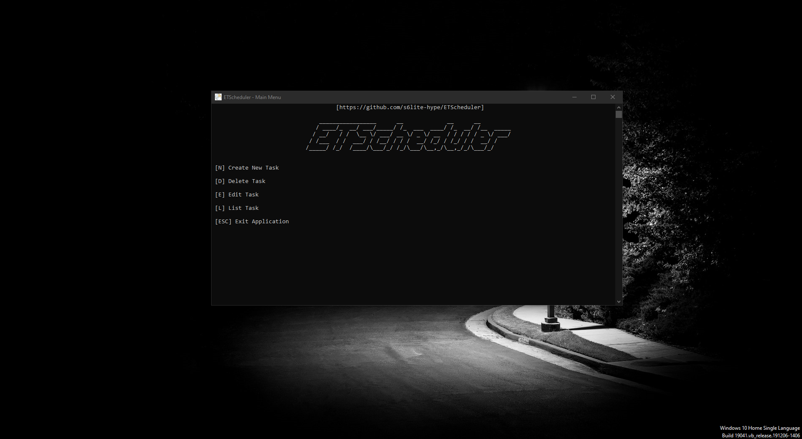

# ETScheduler - Preview
> [!WARNING]
> Please be advised that I shall not be held liable for any form of data loss or damage incurred through the use of this program. Users assume all risks associated with the installation and utilization of the software. It is strongly recommended that users implement comprehensive data backup measures and exercise caution when deploying this program in any environment. By proceeding with the use of this program, users acknowledge and accept full responsibility for any potential adverse effects, including but not limited to data corruption, hardware malfunctions, or system failures. The developer disclaims any liability for incidental, consequential, or special damages of any nature arising from the use or performance of the program.

## What does this program even used for?
This software provides comprehensive functionality to manage tasks efficiently. You can create, edit, delete, or list tasks effortlessly, streamlining your task management process.

This software operates on a Click-To-Run model, requiring no external files or folders for its functionality. However, it may utilize Win32API for certain operations, necessitating access to and utilization of this component.

Please refer to the screenshot below for a visual representation of the program's interface:

> [!INFO]
> This program supports the following Operating System :
> 1. Windows Vista and above (but maybe with a bug)
> 2. Windows 10 and above (recommended)
>
> This program has 2 type of executable :
> 1. x64-bit
> 2. x32-bit
>
> Choose the exectutable Architecture following what your system supports.
